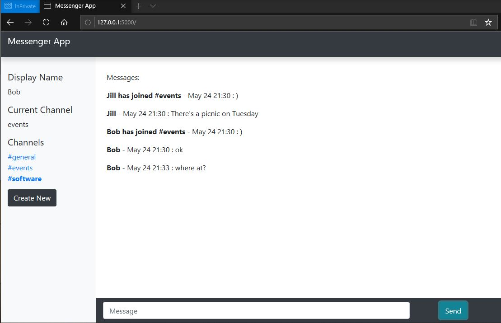

# Messaging App

This project is a simple messageing app based on slack that utilizes ajax to display messages real-time to all users. 

## Build Status

[](https://travis-ci.org/asteinig4018/messaging_app)

## Features

* Users can join or create channels
* When a new user joins a channel he/she is announced
* Channels with messages the user has not yet read will become bold
* The last 100 messages will be stored in each channel 

 

## Technologies Used

* Flask 1.1.2
* Python 3.6
* JavaScript ES6 and Ajax
* Ruby Sass 3.7
* Jinja 2.11
* Bootstrap


## Use

### Setup

Required Python packages can be installed with 
```
pip install -r requirements.txt
```

### Run

As a flask app, this is very straightforward to run. Make sure you ```export FLASK_APP="application.py"``` and then 
```
flask run
```

You must use seperate browsers to test this locally. In my testing, Chrome and Mozilla both store local data in the same spot, even when private or incognito. 


## Future Potential Improvements

* Have message send on enter button
* Add ability to upload images
* Add ability to react to messages
* Plenty of security issues and edge cases to be addressed